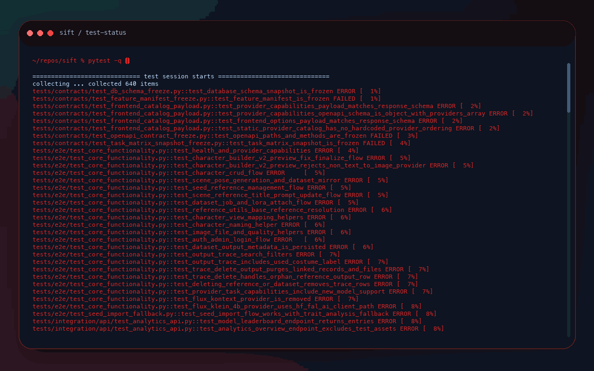

<div align="center">


# sift

### Turn noisy command output into actionable diagnoses for your coding agent

**Benchmark-backed test triage - Heuristic-first reductions - Agent-ready terminal workflows**

[](https://www.npmjs.com/package/@bilalimamoglu/sift)
[](LICENSE)
[](https://github.com/bilalimamoglu/sift/actions/workflows/ci.yml)
[](https://nodejs.org/)

<br />

### Get Started

```bash
npm install -g @bilalimamoglu/sift
```

<sub>Works with pytest, vitest, jest, tsc, ESLint, webpack, Cargo, terraform, npm audit, and more.</sub>

</div>

---

## Why Sift?

When an agent hits noisy output, it burns budget reading logs instead of fixing the problem.

`sift` sits in front of that output and reduces it into a small, actionable first pass. Your agent reads the diagnosis, not the wall of text.

Turn 13,000 lines of test output into 2 root causes.

<p align="center">
  
</p>

With `sift`, the same run becomes:

```text
- Tests did not pass.
- 3 tests failed. 125 errors occurred.
- Shared blocker: 125 errors share the same root cause - a missing test environment variable.
  Anchor: tests/conftest.py
  Fix: Set the required env var before rerunning DB-isolated tests.
- Contract drift: 3 snapshot tests are out of sync with the current API or model state.
  Anchor: tests/contracts/test_feature_manifest_freeze.py
  Fix: Regenerate the snapshots if the changes are intentional.
- Decision: stop and act.
```

In the largest benchmark fixture, sift compressed 198,026 raw output tokens to 129. That is what the agent reads instead of the full log.

---

## Benchmark Results

The output reduction above measures a single command's raw output. The table below measures the full end-to-end debug session: how many tokens, tool calls, and seconds the agent spends to reach the same diagnosis.

Real debug loop on a 640-test Python backend with 124 repeated setup errors, 3 contract failures, and 511 passing tests:

| Metric | Without sift | With sift | Reduction |
|--------|-------------:|----------:|----------:|
| Tokens | 52,944 | 20,049 | 62% fewer |
| Tool calls | 40.8 | 12 | 71% fewer |
| Wall-clock time | 244s | 85s | 65% faster |
| Commands | 15.5 | 6 | 61% fewer |
| Diagnosis | Same | Same | Same outcome |

Same diagnosis, less agent thrash.

Methodology and caveats: [BENCHMARK_NOTES.md](BENCHMARK_NOTES.md)

---

## How It Works

`sift` keeps the explanation simple:

1. **Capture output.** Run the noisy command or accept already-existing piped output.
2. **Run local heuristics.** Detect known failure shapes first so common cases stay cheap and deterministic.
3. **Return the diagnosis.** When heuristics are confident, `sift` gives the agent the root cause, anchor, and next step.
4. **Fall back only when needed.** If heuristics are not enough, `sift` uses a cheaper model instead of spending your main agent budget.

Your agent spends tokens fixing, not reading.

---

## Key Features

<table>
<tr>
<td width="33%" valign="top">

### Test Failure Triage
Collapse repeated pytest, vitest, and jest failures into a short diagnosis with root-cause buckets, anchors, and fix hints.

</td>
<td width="33%" valign="top">

### Typecheck and Lint Reduction
Group noisy `tsc` and ESLint output into the few issues that actually matter instead of dumping the whole log back into the model.

</td>
<td width="33%" valign="top">

### Build Failure Extraction
Pull out the first concrete error from webpack, esbuild/Vite, Cargo, Go, GCC/Clang, and similar build output.

</td>
</tr>
<tr>
<td width="33%" valign="top">

### Audit and Infra Risk
Surface high-impact `npm audit` findings and destructive `terraform plan` signals without making the agent read everything.

</td>
<td width="33%" valign="top">

### Heuristic-First by Default
Every built-in preset tries local parsing first. When the heuristic handles the output, no provider call is needed.

</td>
<td width="33%" valign="top">

### Agent and Automation Friendly
Use `sift` in Codex, Claude, CI, hooks, or shell scripts so downstream tooling gets short, structured answers instead of raw noise.

</td>
</tr>
</table>

---

## Setup and Agent Integration

Most built-in presets run entirely on local heuristics with no API key needed. For presets that fall back to a model (`diff-summary`, `log-errors`, or when heuristics are not confident enough), sift supports OpenAI-compatible and OpenRouter-compatible endpoints.

Set up the provider first, then install the managed instruction block for the agent you want to steer:

```bash
sift config setup
sift doctor
sift agent install codex
sift agent install claude
```

You can also preview, inspect, or remove those blocks:

```bash
sift agent show codex
sift agent status
sift agent remove codex
```

Command-first details live in [docs/cli-reference.md](docs/cli-reference.md).

---

## Quick Start

### 1. Install

```bash
npm install -g @bilalimamoglu/sift
```

Requires Node.js 20+.

### 2. Run Sift in front of a noisy command

```bash
sift exec --preset test-status -- pytest -q
```

Other common entry points:

```bash
sift exec --preset test-status -- npx vitest run
sift exec --preset test-status -- npx jest
sift exec "what changed?" -- git diff
```

### 3. Zoom only if needed

Think of the workflow like this:

- `standard` = map
- `focused` = zoom
- raw traceback = last resort

```bash
sift rerun
sift rerun --remaining --detail focused
```

If `standard` already gives you the root cause, anchor, and fix, stop there and act.

---

## Presets

| Preset | What it does | Needs provider? |
|--------|--------------|:---------------:|
| `test-status` | Groups pytest, vitest, and jest failures into root-cause buckets with anchors and fix suggestions. | No |
| `typecheck-summary` | Parses `tsc` output and groups issues by error code. | No |
| `lint-failures` | Parses ESLint output and groups failures by rule. | No |
| `build-failure` | Extracts the first concrete build error from common toolchains. | Fallback only |
| `audit-critical` | Pulls high and critical `npm audit` findings. | No |
| `infra-risk` | Detects destructive signals in `terraform plan`. | No |
| `diff-summary` | Summarizes change sets and likely risks in diff output. | Yes |
| `log-errors` | Extracts the strongest error signals from noisy logs. | Fallback only |

When output already exists in a pipeline, use pipe mode instead of `exec`:

```bash
pytest -q 2>&1 | sift preset test-status
npm audit 2>&1 | sift preset audit-critical
```

---

## Test Debugging Workflow

For noisy test failures, start with the `test-status` preset and let `standard` be the default stop point.

```bash
sift exec --preset test-status -- <test command>
sift rerun
sift rerun --remaining --detail focused
sift rerun --remaining --detail verbose --show-raw
```

Useful rules of thumb:

- If `standard` ends with `Decision: stop and act`, go read source and fix the issue.
- Use `sift rerun` after a change to refresh the same test command at `standard`.
- Use `sift rerun --remaining` to zoom into what still fails after the first pass.
- Treat raw traceback as the last resort, not the starting point.

For machine branching or automation, `test-status` also supports diagnose JSON:

```bash
sift exec --preset test-status --goal diagnose --format json -- pytest -q
sift rerun --goal diagnose --format json
```

---

## Limitations

- sift adds the most value when output is long, repetitive, and shaped by a small number of root causes. For short, obvious failures it may not save much.
- The deepest local heuristic coverage is in test debugging (pytest, vitest, jest). Other presets have solid heuristics but less depth.
- sift does not help with interactive or TUI-based commands.
- When heuristics cannot explain the output confidently, sift falls back to a provider. If no provider is configured, it returns what the heuristics could extract and signals that raw output may still be needed.

---

## Docs

- CLI reference: [docs/cli-reference.md](docs/cli-reference.md)
- Worked examples: [docs/examples](docs/examples)
- Benchmark methodology: [BENCHMARK_NOTES.md](BENCHMARK_NOTES.md)
- Release notes: [release-notes](release-notes)

---

## License

MIT

---

<div align="center">

Built for agent-first terminal workflows.

[Report Bug](https://github.com/bilalimamoglu/sift/issues) | [Request Feature](https://github.com/bilalimamoglu/sift/issues)

</div>
