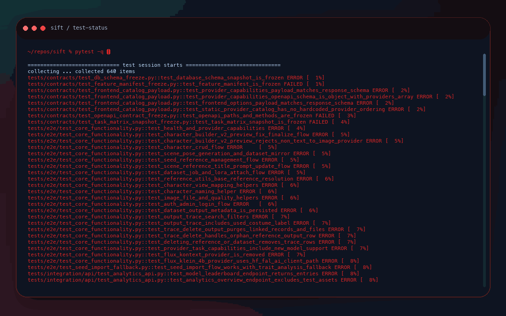

<div align="center">


# sift

### Turn noisy command output into a short, actionable first pass for your coding agent

**Local heuristics first. Group repeated failures into likely root causes and next steps before your agent reads the full log.**

[](https://www.npmjs.com/package/@bilalimamoglu/sift)
[](LICENSE)
[](https://github.com/bilalimamoglu/sift/actions/workflows/ci.yml)
[](https://nodejs.org/)

<br />

### Get Started

```bash
npm install -g @bilalimamoglu/sift
```

<sub>Works with pytest, vitest, jest, tsc, ESLint, webpack, Cargo, terraform, npm audit, and more.</sub>

</div>

---

## Why Sift?

When an agent hits noisy output, it can eventually make sense of the log wall, but it wastes time and tokens getting there.

`sift` narrows that output locally first. It groups repeated failures, surfaces likely root causes, and points to the next useful step so your agent starts from signal instead of raw noise.

Turn 13,000 lines of test output into 2 root causes.

<p align="center">
  
</p>

With `sift`, the same run becomes:

```text
- Tests did not pass.
- 3 tests failed. 125 errors occurred.
- Shared blocker: 125 errors share the same root cause - a missing test environment variable.
  Anchor: tests/conftest.py
  Fix: Set the required env var before rerunning DB-isolated tests.
- Contract drift: 3 snapshot tests are out of sync with the current API or model state.
  Anchor: tests/contracts/test_feature_manifest_freeze.py
  Fix: Regenerate the snapshots if the changes are intentional.
- Decision: stop and act.
```

In the largest benchmark fixture, sift compressed 198,026 raw output tokens to 129. That is what the agent reads instead of the full log.

---

## Benchmark Results

The output reduction above measures a single command's raw output. The table below measures the full end-to-end debug session: how many tokens, tool calls, and seconds the agent spends to reach the same outcome.

Real debug loop on a 640-test Python backend with 124 repeated setup errors, 3 contract failures, and 511 passing tests:

| Metric | Without sift | With sift | Reduction |
|--------|-------------:|----------:|----------:|
| Tokens | 52,944 | 20,049 | 62% fewer |
| Tool calls | 40.8 | 12 | 71% fewer |
| Wall-clock time | 244s | 85s | 65% faster |
| Commands | 15.5 | 6 | 61% fewer |
| Outcome | Same | Same | Same outcome |

Same outcome, less agent thrash.

Methodology and caveats: [BENCHMARK_NOTES.md](BENCHMARK_NOTES.md)

---

## How It Works

`sift` keeps the explanation simple:

1. **Capture output.** Run the noisy command or accept already-existing piped output.
2. **Run local heuristics.** Detect known failure shapes first so common cases stay cheap and deterministic.
3. **Return a useful first pass.** When heuristics are confident, `sift` gives the agent grouped failures, likely root causes, and the next step.
4. **Fall back only when needed.** If heuristics are not enough, `sift` uses a cheaper model instead of spending your main agent budget.

Your agent spends tokens fixing, not reading.

---

## Key Features

<table>
<tr>
<td width="33%" valign="top">

### Test Failure Guidance
Collapse repeated pytest, vitest, and jest failures into grouped issues with likely root causes, anchors, and fix hints.

</td>
<td width="33%" valign="top">

### Typecheck and Lint Guidance
Group noisy `tsc` and ESLint output into the few issues that actually matter instead of dumping the whole log back into the model.

</td>
<td width="33%" valign="top">

### Build Failure Extraction
Pull out the first concrete error from webpack, esbuild/Vite, Cargo, Go, GCC/Clang, and similar build output.

</td>
</tr>
<tr>
<td width="33%" valign="top">

### Audit and Infra Risk
Surface high-impact `npm audit` findings and destructive `terraform plan` signals without making the agent read everything.

</td>
<td width="33%" valign="top">

### Heuristic-First by Default
Every built-in preset tries local parsing first. When the heuristic handles the output, no provider call is needed.

</td>
<td width="33%" valign="top">

### Agent and Automation Friendly
Use `sift` in Codex, Claude, CI, hooks, or shell scripts so downstream tooling gets short, structured answers instead of raw noise.

</td>
</tr>
</table>

---

## Setup and Agent Integration

Most built-in presets run entirely on local heuristics with no API key required. If you want deeper fallback for ambiguous cases, `sift` also supports OpenAI-compatible and OpenRouter-compatible endpoints.

Start with the guided installer:

```bash
sift install
```

During install, pick the mode that matches reality:
- `agent-escalation`: best if Codex or Claude is already open. `sift` gives the first answer, then your agent keeps going.
- `provider-assisted`: best if you want `sift` itself to ask a cheap fallback model when needed. This is the API-key path.
- `local-only`: best if `sift` is working alone and you want everything to stay local.

Install writes small runtime-native guidance surfaces too:
- Codex: managed `AGENTS.md` block plus a generated `SKILL.md`
- Claude: managed `CLAUDE.md` block plus a generated `.claude/commands/sift/` command pack
- Cursor: an explicit `.cursor/skills/sift/SKILL.md` path when you want a native Cursor skill instead of relying on Codex-skill compatibility

The CLI is still the real runtime. These native files are guidance surfaces, not a second execution system.

Then try the normal diagnosis loop:

```bash
sift exec --preset test-status -- pytest -q
```

Default rule:
- use `sift exec` for the normal first pass
- use `sift hook` only as an optional beta shortcut for a tiny known-command set

The hook beta is not a second primary workflow. It is just a lower-ceremony shortcut when `sift` already knows the command shape.

If you want that optional beta path, inspect the matcher first:

```bash
sift hook match -- pytest -q
```

If it says the command is a known match, you can then use the optional beta entrypoint for that command shape.

Important boundary:
- beta only
- known preset matches only
- unknown commands pass through untouched
- if the hook path fails internally, the original raw command path wins

After a few real runs, you can inspect the local evidence instead of guessing:

```bash
sift gain
sift discover
```

`sift gain` shows the local first-pass history:
- recorded runs
- rough size/token reduction estimates
- which presets you actually use
- whether `sift` stayed heuristic or needed provider help

`sift discover` is intentionally quieter.
It only speaks when your own local `sift` history is thick enough to justify a concrete suggestion, such as:
- "your local `sift` history keeps showing the same command family without the matching built-in preset"
- "your local `sift` history keeps showing the same known command through explicit `sift exec`; check whether the optional hook shortcut is worth it"

Important boundary here too:
- local history only
- metadata only, not raw logs
- rough estimates, not fake precision
- if the evidence is thin, `discover` says so and stays quiet

Safety boundary:
- `sift` now suppresses obvious instruction-like or hostile-looking output lines before they get treated like trustworthy guidance
- this is a narrow safety assist, not a security guarantee or a full prompt-injection solution
- the goal is to keep logs in the “evidence” lane, not silently turn `sift` into a filtering platform

If you choose `provider-assisted` during install, `sift` now continues directly into provider, model, and API-key setup instead of making you run a second command.

### What Sift Will Touch

First-use trust matters, so here is the blunt version:

| Surface | Default path | When written | Ownership rule | Undo |
| --- | --- | --- | --- | --- |
| Codex instructions | `AGENTS.md` or `~/.codex/AGENTS.md` | `sift install codex` / `sift agent install codex` | only inside managed `sift` markers | `sift agent remove codex` |
| Codex skill | repo or global `SKILL.md` | Codex install when `sift` owns the generated skill | custom `SKILL.md` is never overwritten | `sift skill remove codex` |
| Claude instructions | `CLAUDE.md` or `~/.claude/CLAUDE.md` | `sift install claude` / `sift agent install claude` | only inside managed `sift` markers | `sift agent remove claude` |
| Claude command pack | `.claude/commands/sift/` | Claude install when `sift` owns the generated command files | custom command files are never overwritten | `sift agent remove claude` |
| Cursor skill | `.cursor/skills/sift/SKILL.md` or `~/.cursor/skills/sift/SKILL.md` | explicit Cursor install when you want the native path | if a compatible Codex skill already exists in the same scope, `sift` refuses to write a duplicate Cursor copy | `sift skill remove cursor` |
| Provider config | `~/.config/sift/config.yaml` | `provider-assisted` setup unless you later create repo-local config | repo-local `sift.config.yaml` can override machine config for that repo | `sift config setup` / edit config / remove file |

Sift does **not** write shell rc files, PATH entries, git hooks, or arbitrary repo files during install.

If you want the explicit Cursor-native path, use:

```bash
sift install cursor
# or
sift skill install cursor --scope repo --yes
```

Why this is separate:
- Cursor already loads compatible skills from `.codex/skills`
- so `sift` will not install a duplicate native Cursor skill when the same managed Codex skill already exists in that scope

Use `sift config setup` later when you want to revisit or change those choices:

```bash
sift config setup
sift doctor
```

OpenAI setup defaults to `gpt-5-nano`, with `gpt-5.4-nano` and `gpt-5-mini` offered as backup choices during setup.

If a workspace needs extra hardening without turning `sift` into a rules engine, use the tiny `safety` block in `sift.config.yaml`:

```yaml
safety:
  enabled: true
  extraRiskPatterns:
    - internal build note
  ignoredRiskPatterns:
    - ignore previous instructions
```

Keep it small. These are substring hints for the hardening pass, not a custom filtering DSL.

The same config also exposes a tiny history block:

```yaml
history:
  enabled: true
  retentionDays: 30
```

This controls local `sift gain` / `sift discover` history only.
It does not turn `sift` into shell-wide telemetry, and it does not store raw command output.

Before pushing release-sensitive changes, run the same shared gate used by CI and the release workflow:

```bash
npm run verify:release
```

That gate runs under a CI-like environment on purpose so wrapper-noise regressions show up locally before they embarrass the repo in publish.

If you want one extra paranoid pass before a release or risky push, use the clean-room variant too:

```bash
npm run verify:release:clean
```

That copies the repo into a temporary clean directory, runs `npm ci`, then executes the shared core gate there so warm local `node_modules` do not hide CI failures.

If you want pushes to enforce the same core gate automatically inside this repo:

```bash
npm run setup:hooks
```

That installs the tracked `.githooks/pre-push` hook, which runs `npm run verify:release:core` before every push.

If you want the older low-level controls, you can still preview, inspect, or remove the managed blocks directly:

```bash
sift agent show codex
sift agent install codex --dry-run
sift agent status
sift agent remove codex
```

If you want to preview or manage the generated Codex skill directly, use:

```bash
sift skill show codex
sift skill install codex --scope global --yes
sift skill status
sift skill remove codex --scope global --yes
```

`sift` only updates or removes the generated skill when it can clearly prove ownership of that `SKILL.md` file.

Command-first details live in [docs/cli-reference.md](docs/cli-reference.md).

---

## Quick Start

### 1. Install

```bash
npm install -g @bilalimamoglu/sift
```

Requires Node.js 20+.

### 2. Get a useful first pass before your agent reads the full log

If you are new, start here and ignore hook beta until you have seen one good `sift exec` result.

```bash
sift exec --preset test-status -- pytest -q
```

Other common entry points:

```bash
sift exec --preset test-status -- npx vitest run
sift exec --preset test-status -- npx jest
sift exec "what changed?" -- git diff
```

### 3. Zoom only if needed

Think of the workflow like this:

- `standard` = map
- `focused` = zoom
- raw traceback = last resort

```bash
sift rerun
sift rerun --remaining --detail focused
```

If `standard` already gives you the likely root cause, anchor, and fix, stop there and act.

---

## Presets

| Preset | What it does | Needs provider? |
|--------|--------------|:---------------:|
| `test-status` | Groups pytest, vitest, and jest failures into root-cause buckets with anchors and fix suggestions. | No |
| `typecheck-summary` | Parses `tsc` output and groups issues by error code. | No |
| `lint-failures` | Parses ESLint output and groups failures by rule. | No |
| `build-failure` | Extracts the first concrete build error from common toolchains. | Fallback only |
| `audit-critical` | Pulls high and critical `npm audit` findings. | No |
| `infra-risk` | Detects destructive signals in `terraform plan`. | No |
| `diff-summary` | Summarizes change sets and likely risks in diff output. | Yes |
| `log-errors` | Extracts the strongest error signals from noisy logs. | Fallback only |

When output already exists in a pipeline, use pipe mode instead of `exec`:

```bash
pytest -q 2>&1 | sift preset test-status
npm audit 2>&1 | sift preset audit-critical
```

---

## Test Debugging Workflow

For noisy test failures, start with the `test-status` preset and let `standard` be the default stop point.

```bash
sift exec --preset test-status -- <test command>
sift rerun
sift rerun --remaining --detail focused
sift rerun --remaining --detail verbose --show-raw
```

Useful rules of thumb:

- If `standard` ends with `Decision: stop and act`, go read source and fix the issue.
- Use `sift rerun` after a change to refresh the same test command at `standard`.
- Use `sift rerun --remaining` to zoom into what still fails after the first pass.
- Treat raw traceback as the last resort, not the starting point.

For machine branching or automation, `test-status` also supports diagnose JSON:

```bash
sift exec --preset test-status --goal diagnose --format json -- pytest -q
sift rerun --goal diagnose --format json
```

---

## Limitations

- sift adds the most value when output is long, repetitive, and shaped by a small number of root causes. For short, obvious failures it may not save much.
- The deepest local heuristic coverage is in test debugging (pytest, vitest, jest). Other presets have solid heuristics but less depth.
- sift does not help with interactive or TUI-based commands.
- When heuristics cannot explain the output confidently, sift either falls back to a provider or returns the strongest local first pass it can, depending on how you choose to use it.

---

## Docs

- CLI reference: [docs/cli-reference.md](docs/cli-reference.md)
- Worked examples: [docs/examples](docs/examples)
- Benchmark methodology: [BENCHMARK_NOTES.md](BENCHMARK_NOTES.md)
- Contributing and development notes: [CONTRIBUTING.md](CONTRIBUTING.md)
- Release notes: [release-notes](release-notes)

---

## License

MIT

---

<div align="center">

Local-first output guidance for coding agents.

[Report Bug](https://github.com/bilalimamoglu/sift/issues) | [Request Feature](https://github.com/bilalimamoglu/sift/issues)

</div>
